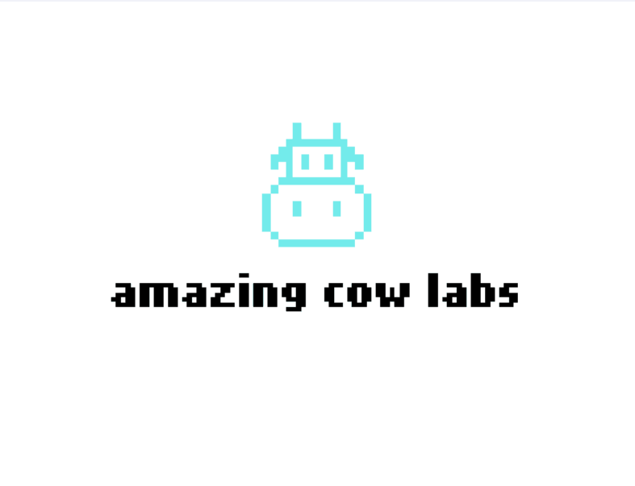

# Taz

**Made with <3 by [mateus.digital](https://mateus.digital).**

## Description:

<p align="center">
    
</p>

This was one of my first games that I developed back in 2015-2016.
I created it using pygame and numpy and it is a clone of the Atari Taz.


For a long time I forgot this project, but decided to release it now :)

<br>

As usual, you are **very welcomed** to **share** and **hack** it.


## Building


```powershell
git clone https://github.com/mateusdigital/taz
cd ram_it

pip install -r requirements.txt     ## Install the dependencies.

./scripts/build-game.ps1            ## Builds the platform version of the game.
./scripts/generate-release-zip.ps1  ## Packages the game and resources to distribution.
```

## Dependencies:

- Pygame: [https://www.pygame.org/](https://www.pygame.org/)
- PyInstaller: [https://www.pyinstaller.org/](https://www.pyinstaller.org/)

## Thanks to:

I used a lot of free and open resources, for which I'm most grateful!


## License:

This software is released under [GPLv3](https://www.gnu.org/licenses/gpl-3.0.en.html).


## Others:

- Email: hello@mateus.digital
- Website: https://mateus.digital
- Itch.io: https://mateusdigital.itch.io
- Linkedin: https://www.linkedin.com/in/mateusdigital
- Twitter: https://www.twitter.com/_mateusdigital
- Youtube: https://www.youtube.com/@_mateusdigital

There's more FLOSS things at [mateus.digital](https://mateus.digital) :)
